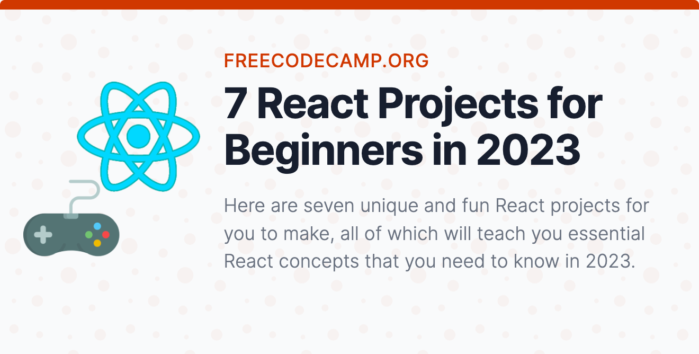

## Example projects

A collection of examples, boilerplates, and scaffolds to jumpstart your next Material UI project.

## Official examples

The following starter projects are all available in the /examples folder of the Material UI GitHub repository. These examples feature Material UI paired with other popular React libraries and frameworks, so you can skip the initial setup steps and jump straight into building.

Not sure which to pick? We recommend Next.js for server-side rendering, or Vite if you're looking to build a SPA. See Start a New React Project from the official React docs to learn more about the options available.

:::tip

**Usage with Prettier**
If you use Prettier to format your Markdown files, Prettier might auto-format your code to invalid admonition syntax. To avoid this problem, add empty lines around the starting and ending directives. This is also why the examples we show here all have empty lines around the content.

:::

